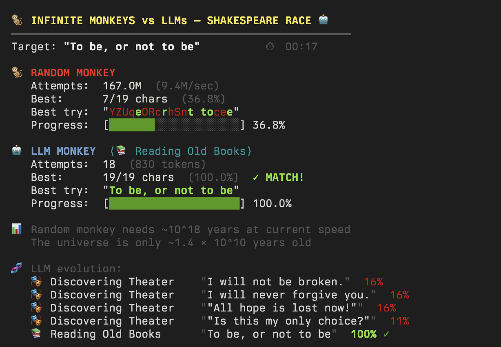

# 🐒 Infinite Monkeys vs LLMs — Shakespeare Race

The [infinite monkey theorem](https://en.wikipedia.org/wiki/Infinite_monkey_theorem) says that a monkey hitting random keys on a typewriter will *eventually* produce Shakespeare — given enough time (way more than the age of the universe).

But what if the monkey had an LLM? **How much faster can intelligence beat pure randomness?**

This is a fun terminal simulation that races a random character generator against an LLM to see who can produce `"To be, or not to be"` first.



## How It Works

**🐒 Random Monkey** — Generates millions of random strings per second and checks each one character-by-character against the target. At ~9M attempts/sec, it would still need roughly **10^18 years** to guarantee a match. The universe is only ~10^10 years old.

**🤖 LLM Monkey** — Evolves through 8 increasingly sophisticated stages, from mashing random keys to contemplating the classics. Crucially, it's **never told what quote to find** — it has to stumble onto it through vague, indirect prompts:

| Stage | What it's doing |
|---|---|
| 🐒 Random Mashing | Pure gibberish |
| 🔤 Learning Letters | English-ish nonsense |
| ✏️ Forming Sentences | Short philosophical phrases |
| 🤔 Pondering Existence | Phrases about existing |
| 🎭 Discovering Theater | Dramatic stage lines |
| 📚 Reading Old Books | Old English literature quotes |
| 🎓 Studying the Classics | Pre-1700 play quotes |
| 🧠 Deep Contemplation | Famous theater quotes |

The LLM typically finds the target in **~15-20 attempts** and under 30 seconds — roughly **10^25x faster** than random chance.

## Quick Start

```bash
npm install
npm start
```

Requires a GitHub token for the LLM (uses [GitHub Models](https://github.com/marketplace/models) API via `gpt-4o-mini`). The token is read from `GITHUB_TOKEN` or auto-detected from the `gh` CLI:

```bash
# Option A: use gh CLI (if already logged in)
gh auth login

# Option B: set explicitly
export GITHUB_TOKEN=your_token
```

## Built With

- TypeScript + [tsx](https://github.com/privatenumber/tsx)
- [OpenAI SDK](https://github.com/openai/openai-node) pointed at GitHub Models API
- [Chalk](https://github.com/chalk/chalk) for terminal colors

## License

MIT
